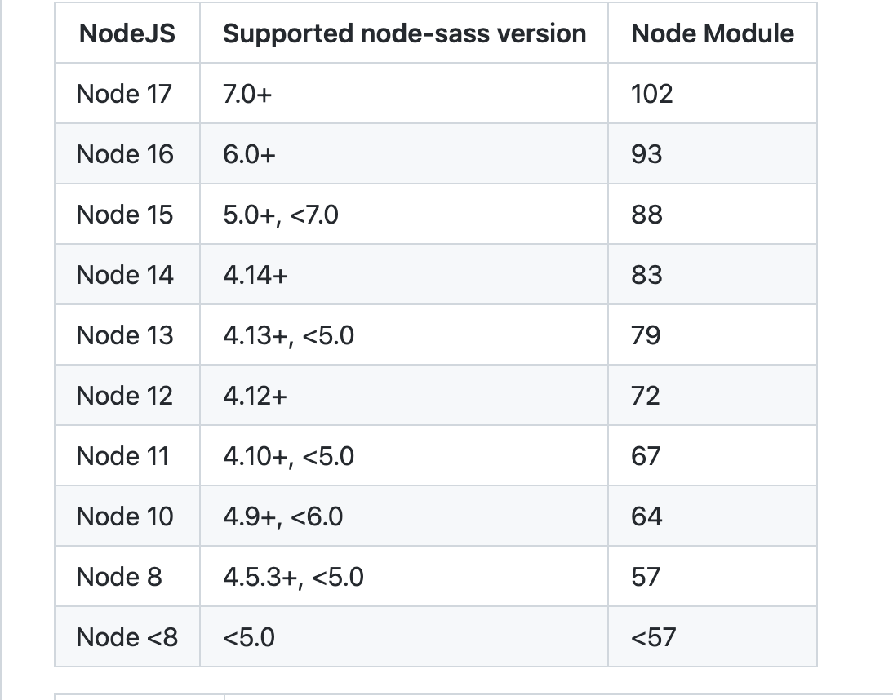

# 解决node12 安装node-sass失败问题

## 1. 简介
> node12版本安装sass的时候, 所需要的sass版本不能太高. 不然会报错
> 
> 可以先到sass的[github](https://github.com/sass/node-sass)上查看对应版本


> 上面截图显示, node12 对应的 sass版本是4.12+ 所以, 卸载现有的sass, 安装指定版本即可

## 2. 查看当前sass版本
```bash
npm list node-sass
```
> 比如我这里是4.14.1, 但我实际需要的是4.12.0

## 2. 卸载现有的sass
```bash
npm uninstall node-sass@4.14.1
```

## 3. 安装指定版本的sass
```bash
npm install node-sass@4.12.0
```

## 4. 安装成功
> 运行第三步后, 再次查看sass版本, 如果是4.12.0, 表示安装成功
